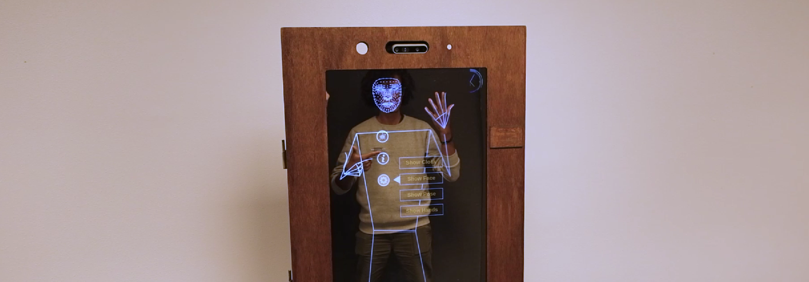

# Second Self

## Description

Second Self is an augmented reality platform based on an augmented mirror: a mirror on which information can be displayed. This project uses an augmented mirror with the Intel D435, a depth and color camera. Using this camera and the pose estimation library mediapipe, a user standing in front of the mirror can interact with it using gestures.  
This project runs using [gosai](https://github.com/GOSAI-DVIC/gosai)
  
## Ressources:

- https://github.com/openpifpaf/openpifpaf
- https://google.github.io/mediapipe/solutions/hands.html
- https://google.github.io/mediapipe/solutions/holistic.html
- https://github.com/IntelRealSense/librealsense/
- https://github.com/socketio/socket.io
- https://p5js.org/
